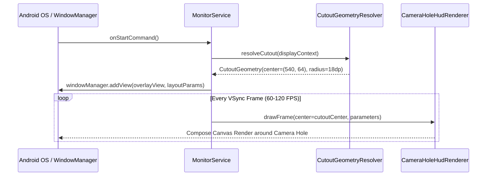

# Design 1: Camera-Hole Overlay Geometry & Dynamic Positioning

## 1. Executive Summary

This architecture defines the spatial allocation, coordinate calculation, and WindowManager overlay parameters to position the Antigravity Holographic HUD concentric to the front camera punch-hole cutout across different display form factors (Google Pixel 8 and Google Pixel 11 Pro).

---

## 2. Dynamic Punch-Hole Cutout Detection

Modern Pixel devices feature centered display cutouts with varying physical radii and status bar heights:
- **Google Pixel 8 (`shiba`):** 6.2" OLED (1080 × 2400 px, ~428 PPI), centered punch-hole camera at $X \approx 540\text{px}, Y \approx 64\text{px}$, cutout radius $\approx 18\text{dp}$.
- **Google Pixel 11 Pro (`caiman`/`grizzly`):** 6.3" LTPO OLED (1280 × 2856 px, ~495 PPI), centered punch-hole camera at $X \approx 640\text{px}, Y \approx 78\text{px}$, cutout radius $\approx 20\text{dp}$.

### 2.1 Runtime Cutout Query via `WindowInsets`
Rather than hardcoding physical offsets, the positioning engine queries Android's `DisplayCutout` API:

```kotlin
fun calculateCameraCutoutBounds(window: Window): CutoutGeometry {
    val insets = window.decorView.rootWindowInsets
    val cutout = insets?.displayCutout
    val topRect = cutout?.boundingRectTop ?: Rect()
    
    val centerX = if (!topRect.isEmpty) topRect.exactCenterX() else (displayMetrics.widthPixels / 2f)
    val centerY = if (!topRect.isEmpty) topRect.exactCenterY() else (statusBarHeight / 2f)
    val diameter = if (!topRect.isEmpty) maxOf(topRect.width(), topRect.height()).toFloat() else 36.dpToPx()
    
    return CutoutGeometry(
        centerXPx = centerX,
        centerYPx = centerY,
        cutoutDiameterPx = diameter,
        statusBarHeightPx = insets?.getInsets(WindowInsets.Type.statusBars())?.top ?: 0
    )
}
```

---

## 3. Overlay Sizing & WindowManager Configuration

The system overlay runs as an unprivileged background `Service` using `WindowManager.LayoutParams`:

### 3.1 Three Distinct Sizing & Display Modes
1. **Camera Halo Mode (Default Ambient):**
   - Size: Compact $56\text{dp} \times 56\text{dp}$ to $72\text{dp} \times 72\text{dp}$.
   - Position: Precisely centered over $(X_{\text{cutout}}, Y_{\text{cutout}})$.
   - Visual: Concentric 3D rings encircle the front camera lens.
2. **Status Bar Bezel Mode:**
   - Size: Full display width ($1080\dots 1280\text{px}$) × Status Bar Height ($32\dots 40\text{dp}$).
   - Position: Gravity `TOP | START`, flush with screen edges.
   - Visual: Camera-centered concentric rings flanked by left RAM/zRAM edge line and right CPU/GPU thermal bezel bar.
3. **Sandbox Controller Mode:**
   - Full interactive dashboard inside `MainActivity` for testing, tuning parameters, and running stress scenarios.

### 3.2 Non-Intrusive Touch Pass-Through
To allow users to interact normally with apps, status bar pull-downs, and notifications without obstruction:
- `WindowManager.LayoutParams.TYPE_APPLICATION_OVERLAY`
- `FLAG_NOT_FOCUSABLE` (prevents stealing keyboard or input focus)
- `FLAG_NOT_TOUCHABLE` (all touch events pass straight through to underlying applications)
- `FLAG_LAYOUT_IN_SCREEN` & `FLAG_LAYOUT_NO_LIMITS` (allows overlay coordinates to extend under display cutouts and status bars)

---

## 4. Architectural Sequence


