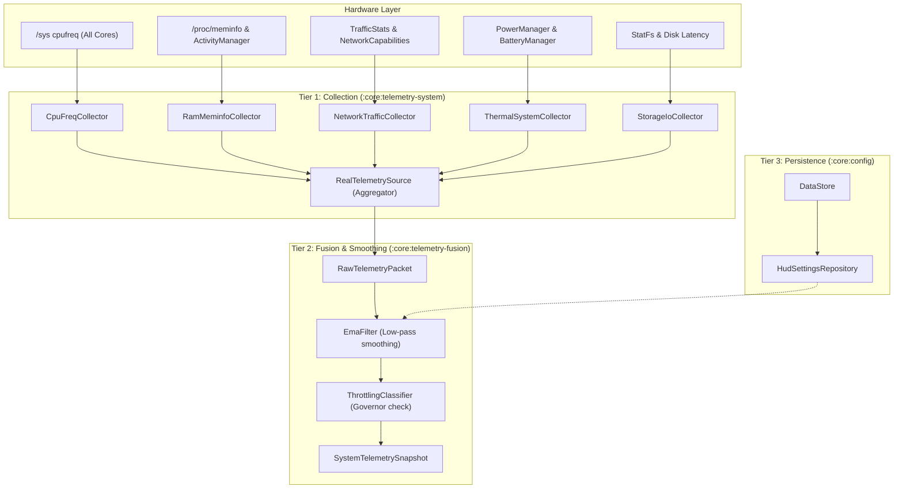

# Design 2: Real System Telemetry & DataStore Persistence Architecture

## 1. Executive Summary

This architecture defines the real-time hardware telemetry ingestion pipeline and user configuration persistence layer for Antigravity HUD on modern Android (Android 14 through Android 17). It establishes a dual-tier ingestion model that provides zero-permission non-root operation out of the box with optional root/Shizuku enhancements, backed by Jetpack DataStore for persistent settings.

---

## 2. Telemetry Subsystem Ingestion Matrix

| Telemetry Channel | Primary Non-Root Source (Retail Devices) | Shizuku / Root Extended Source | Sampling Cadence | Normalized Load Formula |
| :--- | :--- | :--- | :--- | :--- |
| **CPU Load & Governor** | `/sys/devices/system/cpu/cpu*/cpufreq/scaling_cur_freq` & `cpuinfo_max_freq` across all cores | `/proc/stat` total vs idle jiffies delta | 250ms (active) / 1000ms (idle) | $L_{\text{cpu}} = \frac{\sum (f_{\text{cur}} - f_{\text{min}})}{\sum (f_{\text{max}} - f_{\text{min}})}$ |
| **RAM & zRAM Swap** | `ActivityManager.getMemoryInfo()` + `/proc/meminfo` (`MemAvailable`, `SwapTotal`, `SwapFree`) | `/proc/vmstat` `compact_stall` & `zram_stored_pages` | 500ms / 2000ms | $L_{\text{ram}} = 1.0 - \frac{\text{MemAvailable}}{\text{MemTotal}}$, $L_{\text{zram}} = 1.0 - \frac{\text{SwapFree}}{\text{SwapTotal}}$ |
| **Network Throughput & RF** | `TrafficStats.getTotalRxBytes()` / `TxBytes()` delta + `NetworkCapabilities` / `TelephonyCallback` | Kernel socket statistics | 250ms / 1000ms | $L_{\text{net}} = \log_{10}(1 + \frac{\text{BytesPerSec}}{100\text{ KB/s}}) \cdot \text{scale}$ |
| **Storage (SSD) I/O** | `android.os.StatFs` + atomic sync latency delta | `/proc/diskstats` read/write sectors & iowait cycles | 1000ms / 3000ms | $L_{\text{ssd}} = \text{iowait\_ratio}$ or flush flare trigger |
| **GPU Pipeline & Thermals** | `PowerManager.OnThermalStatusChangedListener` + `BatteryManager.EXTRA_TEMPERATURE` + `Choreographer` frame drop rate | Mali GPU sysfs node `/sys/devices/platform/1f000000.mali/` utilization | Event-driven + 500ms | $L_{\text{therm}} = \text{thermalStatusLevel} / 5.0$ |

---

## 3. Real Telemetry Pipeline Architecture



---

## 4. Settings Persistence Schema (Jetpack DataStore)

User preferences are stored reactively via Jetpack DataStore Preferences:

```kotlin
object HudPreferencesKeys {
    val OVERLAY_ENABLED = booleanPreferencesKey("overlay_enabled")
    val OVERLAY_MODE = stringPreferencesKey("overlay_mode") // CAMERA_HALO, STATUS_BAR, OFF
    val HALO_DIAMETER_DP = floatPreferencesKey("halo_diameter_dp") // 40.0 .. 80.0
    val SPEED_V_MIN = floatPreferencesKey("speed_v_min") // 0.1 .. 1.0 RPS
    val SPEED_V_MAX = floatPreferencesKey("speed_v_max") // 2.0 .. 10.0 RPS
    val SPEED_CURVE = stringPreferencesKey("speed_curve") // QUADRATIC, LINEAR, SIGMOID
    val OUTER_SENSITIVITY = floatPreferencesKey("outer_sensitivity")
    val MIDDLE_SENSITIVITY = floatPreferencesKey("middle_sensitivity")
    val INNER_SENSITIVITY = floatPreferencesKey("inner_sensitivity")
    val MELTDOWN_THRESHOLD = floatPreferencesKey("meltdown_threshold")
    val CHANNEL_CPU_MAPPING = stringPreferencesKey("channel_cpu_mapping") // RING_1, RING_2, etc.
}
```

This ensures that upon app launch or device reboot, the user's overlay configuration, custom speeds, and calibrated sensitivities are immediately restored.
