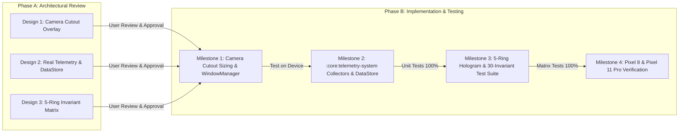

# Design 3: Multi-Channel Hologram Projection & 30-Invariant Integrity Architecture

## 1. Executive Summary & Geometry Research

This architecture expands the 3D Holographic HUD from 3 channels to a complete 5-channel real-time telemetry model. It evaluates spatial layout options, defines the 3D projection physics for encircling the camera punch-hole, formalizes mathematical transfer functions, and establishes an expanded 30-case invariant test matrix.

---

## 2. Geometry Research: 5 Rings vs Hybrid Arcs

### 2.1 Visual Evaluation
When positioning a telemetry HUD around a small front camera punch-hole (~36dp–40dp diameter):
- **Flat 2D Concentric Circles:** Stacking 5 flat 2D concentric circles around a small cutout creates visual crowding and line bleeding unless line thicknesses are reduced to <1px.
- **3D Gyroscopic Orbital Rings (Recommended):** By projecting each ring in 3D space with an independent Euler tilt angle, the rings separate along the Z-axis in perspective projection. Even with 5 rings, each ring maintains visual clarity and distinct orbital motion without colliding:
  - **Ring 1 (Outer, Radius ~28dp, Cyan `#00FFFF`):** CPU Core Load & Governor Frequency ($Y$-axis rotation with 15° tilt).
  - **Ring 2 (Radius ~24dp, Orange `#FF8C00`):** RAM & zRAM Swap Compression ($X$-axis rotation with 15° tilt).
  - **Ring 3 (Radius ~20dp, Magenta `#FF00FF`):** Network Socket Throughput (Diagonal 45° rotation).
  - **Ring 4 (Radius ~16dp, Ice Blue `#80D8FF`):** Storage SSD I/O & Disk Flushes (Counter-diagonal -45° rotation).
  - **Ring 5 (Inner Halo, Radius ~12dp, Emerald `#00E676` / Crimson `#FF1744`):** GPU Load & Thermal Corona encircling the camera lens directly.

---

## 3. Mathematical Parameter Translation Model

Each ring's rotational speed (RPS) is calculated deterministically:

$$V_i = V_{\text{min}} + f_{\text{curve}}\left(\text{clamp}(L_i \cdot S_i, 0.0, 1.0)\right) \cdot (V_{\text{max}} - V_{\text{min}})$$

Where:
- $V_{\text{min}}$ (default 0.2 RPS) and $V_{\text{max}}$ (default 5.0 RPS) are user-configurable.
- $f_{\text{curve}}$:
  - $\text{QUADRATIC}(x) = x^2$ (soft idle, explosive boost)
  - $\text{LINEAR}(x) = x$
  - $\text{SIGMOID}(x) = \frac{1}{1 + e^{-10(x - 0.5)}}$
- $S_i$: Per-channel sensitivity multiplier $[0.1 .. 2.0]$.

### 3.1 Alert State & Color Gamut Rules
- **Meltdown State ($L_{\text{cpu}} \ge 0.90$ or Governor Throttled or Thermal Critical):**
  - All rings shift synchronously to Crimson `#FF1744` with a 2.0 Hz heartbeat strobe.
- **Memory Thrash Alert ($L_{\text{ram}} \ge 0.85$ and zRAM compact stalls > 100):**
  - Ring 2 shifts to Electric Purple `#BA68C8` with high-frequency oscillation.
- **Cellular Degradation Alert (RSRP < -115 dBm):**
  - Ring 3 shifts to Amber `#FFAB00`.
- **Storage Stall Alert (iowait stall detected):**
  - Ring 4 flares bright white before pinning at $V_{\text{min}}$ with a crimson warning strobe.

---

## 4. Expanded 30-Case Invariant Test Matrix

| Case # | Category | Input Metrics (CPU, RAM, Net, SSD, Thermal/GPU) | Expected Ring Speeds (R1..R5) | Expected Palette & Alert State |
| :--- | :--- | :--- | :--- | :--- |
| **1** | Baseline | CPU 0%, RAM 0%, Net 0%, SSD 0%, Therm Nom | All at 0.20 RPS ($V_{\text{min}}$) | NOMINAL, All Base Colors |
| **2** | Baseline | CPU 15%, RAM 25%, Net 5%, SSD 0%, Therm Nom | R1: 0.31, R2: 0.50, R3: 0.21, R4: 0.20, R5: 0.20 | NOMINAL, All Base Colors |
| **3** | Baseline | CPU 10%, RAM 20%, Net 0%, SSD 10%, Therm Nom | R1: 0.25, R2: 0.39, R3: 0.20, R4: 0.25, R5: 0.20 | NOMINAL, All Base Colors |
| **4** | Baseline | CPU 20%, RAM 0% (Fallback), Net 10%, SSD 0% | R1: 0.39, R2: 0.20, R3: 0.25, R4: 0.20, R5: 0.20 | NOMINAL, Safe Fallback |
| **5** | Baseline | All at 29% (Idle Decay Boundary) | All at 0.60 RPS | NOMINAL, Calm Boundary |
| **6** | Single-High | CPU 80%, RAM 15%, Net 10%, SSD 0%, GPU 10% | R1: 3.27, R2: 0.31, R3: 0.25, R4: 0.20, R5: 0.25 | BOOST (CPU), Cyan Fast |
| **7** | Single-High | CPU 100%, Others Low | R1: 5.00, R2..R5: Base | MELTDOWN, All Crimson Pulse |
| **8** | Single-High | RAM 80%, Others Low | R2: 3.27, R1,R3..R5: Base | BOOST (RAM), Orange Fast |
| **9** | Single-High | RAM 100%, Others Low | R2: 5.00, Others: Base | PEAK (RAM), Orange Max |
| **10** | Single-High | Net 80%, Others Low | R3: 3.27, Others: Base | BOOST (Net), Magenta Fast |
| **11** | Single-High | Net 100%, Others Low | R3: 5.00, Others: Base | PEAK (Net), Magenta Max |
| **12** | Single-High | SSD 85% (Heavy Write), Others Low | R4: 3.67, Others: Base | BOOST (SSD), Ice Blue Flare |
| **13** | Single-High | GPU 85% (3D Rendering), Others Low | R5: 3.67, Others: Base | BOOST (GPU), Emerald Fast |
| **14** | Dual-Metric | CPU 85%, RAM 80%, Others Low (Gaming) | R1: 3.67, R2: 3.27, Others: Base | BOOST (Dual), Cyan/Orange Fast |
| **15** | Dual-Metric | CPU 20%, RAM 25%, Net 90%, SSD 80% (Download) | R1: 0.39, R2: 0.50, R3: 4.09, R4: 3.27, R5: 0.20 | BOOST (I/O & Net Active) |
| **16** | Multi-Active | CPU 70%, RAM 70%, Net 70%, SSD 70%, GPU 70% | All at 2.55 RPS | ACTIVE (Uniform 70%) |
| **17** | Balanced | All at 20% (All Low) | All at 0.39 RPS | NOMINAL (All Low) |
| **18** | Balanced | All at 50% (All Mid) | All at 1.40 RPS | ACTIVE (All Mid) |
| **19** | Balanced | All at 75% (All High) | All at 2.90 RPS | BOOST (All High) |
| **20** | Balanced | All at 100% (All Peak Max) | All at 5.00 RPS | MELTDOWN, All Crimson Strobe |
| **21** | Cellular | Cellular RSRP -125 dBm, Net 10%, Others Low | R3: 0.25 (Amber Strobe), Others: Base | CELL_DEGRADED, Ring 3 Amber |
| **22** | Cellular | Cellular RSRP -140 dBm (Dead Zone), Net 0% | R3: 0.20 (Red Strobe), Others: Base | DEAD_ZONE, Ring 3 Alert |
| **23** | Storage Stall | Kernel iowait stall, SSD 95%, CPU 90% | R4: 4.09 (White Flare), R1: 4.09 | IO_WAIT_STALL, Ring 4 Flare |
| **24** | Thermal Crisis | CPU 95% throttled to 394 MHz base clock | R1: 4.53, Others: Calm | MELTDOWN (Clock-Capped), Crimson |
| **25** | Thermal Crisis | CPU 60% with OS Thermal Severe Throttling | R1: 1.93, R5: 3.00 | MELTDOWN (Forced OS), Crimson |
| **26** | Thermal Boost | CPU 88% boosted at 2.9 GHz (No Throttling) | R1: 3.92 (Cyan), Others: Calm | BOOST (No Meltdown Alert) |
| **27** | Memory Thrash | RAM 92% + compact_stalls > 200 | R2: 4.26 (Purple Strobe), Others: Base | MEM_THRASH, Ring 2 Purple |
| **28** | Storage + Net | Net 95% (Download) + SSD 90% (Install) | R3: 4.53, R4: 4.09, Others: Calm | HEAVY_IO_NET, Dual Fast |
| **29** | Robustness | Negative Inputs (All -20%) | All at 0.20 RPS (Safe clamp) | NOMINAL, No NaN/Underflow |
| **30** | Robustness | Overflow Inputs (All 250%) | All at 5.00 RPS (Safe clamp) | MELTDOWN, Safe Overflow Guard |

---

## 5. Phased Testing & Implementation Roadmap

